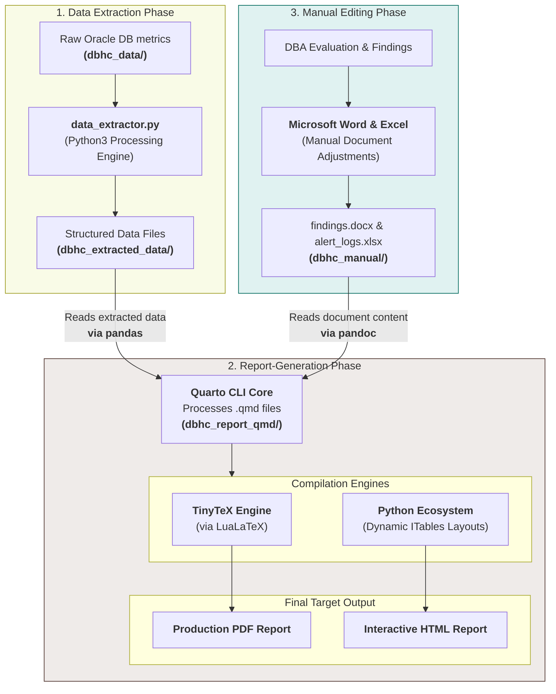
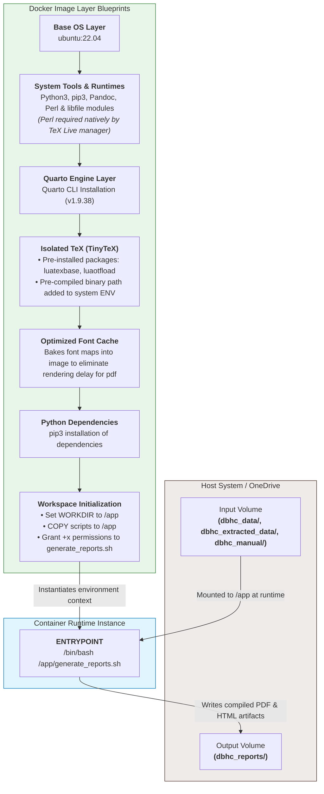

# auto-dbhc-report-generator
A Docker application that automatically generates Oracle Database Health Checkup (DBHC) reports from CSV data files produced by dbhc-data-collector and saves them to a Local/OneDrive folder.

## Prerequisites
- Docker Desktop / Docker Engine
- OneDrive / Local path directory with the following structure:
```
dbhc_onedrive/
├── dbhc_data/
├── dbhc_extracted_data/
├── dbhc_manual/
└── dbhc_reports/
```

## Usage
- Change working directory to report-generator: `cd report-generator`
- Build docker image using Dockerfile: `docker build -t <IMAGE_NAME> .`
- Run docker image with bind mount to OneDrive: `docker run -it -v "<LOCAL_ONEDRIVE_PATH>:/app/dbhc_onedrive" <IMAGE_NAME> [--extract | --generate]`
  - Use `--extract` to only generate extracted data files. Saves output files to `dbhc_extracted_data` folder.
    - When prompted, input the start and end date for the alert logs
  - Use `--generate` to only generate the html and pdf reports. Saves output files to `dbhc_reports` folder.
    - **Requires extracting data first to function properly**
  - Running the command with no options will trigger both data extraction and report generation.
- For manual sections of the report, update the corresponding .docx and .xlsx files in `dbhc_manual` then run the image again.
- To revise the report's metadata (e.g. author, date), update `dbhc_report_qmd/_metadata.qmd`.

## ARCHITECTURE & DESIGN
### Pipeline Lifecycle & Technology Stack
- The generation process executes across three distinct phases, transitioning seamlessly from programmatic extraction and structuring of raw data files to manual DBA review to final document compilation.


### Image Layer Architecture & Execution Flow
- The diagram below details how the layers specified in the Dockerfile assemble to form the runtime environment, and how it maps to host files during execution:
